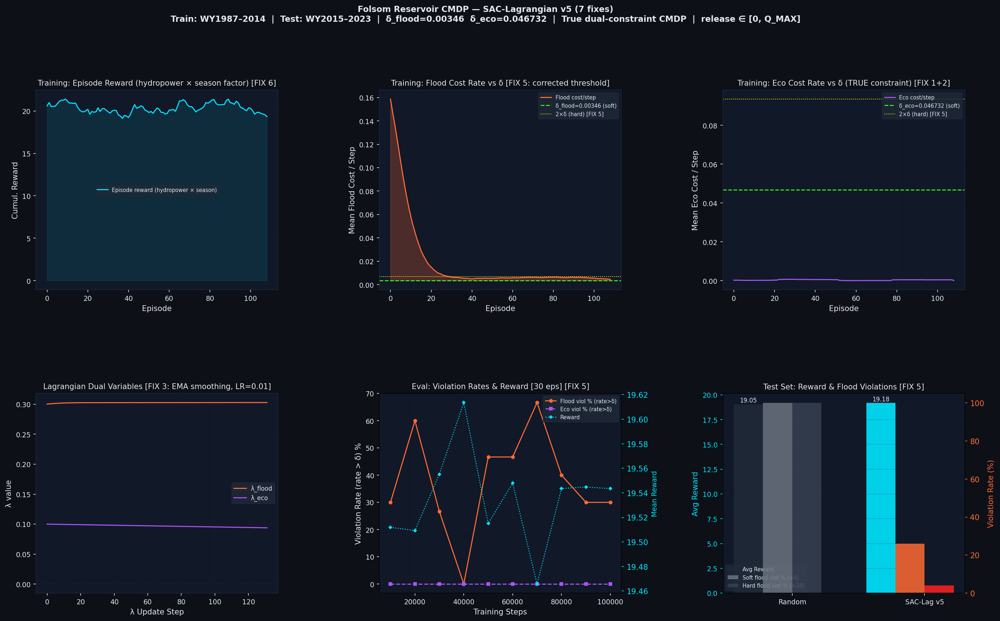

# 🌊 Folsom Reservoir CMDP — SAC-Lagrangian 

> Constrained reinforcement learning for reservoir operations using Soft Actor-Critic with Lagrangian dual variables.

Trained on real USBR hourly inflow data from Folsom Reservoir (California), the agent learns to **maximize hydropower generation** while satisfying flood control and ecological flow constraints simultaneously.

---

## 📊 Results at a Glance



| Policy | Avg Reward | Soft Flood Viol `(>δ)` | Hard Flood Viol `(>2δ)` | Soft Eco Viol `(>δ)` |
|---|---|---|---|---|
| Random | 19.054 | 100.0% | 100.0% | 0.0% |
| **SAC-Lagrangian v5** | **19.178** | **26.0%** | **4.0%** | **0.0%** |

> Train: WY1987–2014 · Test: WY2015–2023 · δ_flood = 0.003463 · δ_eco = 0.046732

**Cost breakdown (SAC-Lag v5, test set):**

| Metric | Value |
|---|---|
| Mean flood cost/step | 0.002518 (δ = 0.003463) ✅ |
| Mean eco cost/step | 0.000000 (δ = 0.046732) ✅ |
| Mean release | 868.2 m³/s |
| Mean spillway | 0.00 m³/s |
| Hard eco violation rate | 0.0% (random: 0.0%) |
| Final λ_flood | 0.3030 |
| Final λ_eco | 0.0939 |

---

## 📌 Overview

This project frames reservoir management as a **Constrained Markov Decision Process (CMDP)**. The agent controls hourly water releases, trading off:

| Objective | Description |
|---|---|
| 🔋 **Reward** | Hydropower generation — `η × H_norm × (Q_rel / Q_max) × season_factor` |
| 🌊 **Constraint 1** | Flood control — downstream flow must not exceed `Q_flood = 1415 m³/s` |
| 🐟 **Constraint 2** | Ecological flow — release must not drop below `Q_min = 14.2 m³/s` |

Constraints are enforced via **Lagrangian dual variables** (`λ_flood`, `λ_eco`) updated online using a trimmed-mean estimator with exponential smoothing.

---

## ✨ Key Features

- **True dual-constraint CMDP** — agent CAN release below `Q_min`, so eco violations are real and the constraint is genuinely active (not trivially satisfied)
- **SAC-Lagrangian** — three separate Q-networks for reward, flood cost, and eco cost
- **Season-varying reward** — `reward = η × H_norm × (Q_rel / Q_max) × (1 + 0.2 × sin(2πt/8760))`
- **Calibrated thresholds** — `δ_flood` and `δ_eco` computed from a baseline simulation on training data (60% of baseline mean cost, with an eco floor of `0.001`)
- **Stable λ updates** — EMA smoothing (0.9/0.1 mix) + trimmed mean (drop top 5%) + full-episode update frequency (every 720 steps)
- **CMDP-correct violation metrics** — soft violation = `rate > δ`; hard = `rate > 2δ`

---

## 🗂️ Repository Structure

```
rl_project/
├── rl-version5.ipynb           # Main training + evaluation notebook
├── results/
│   ├── cmdp_results_v5.png     # 6-panel training and evaluation plot
│   └── results_summary_v5.txt  # Numeric results table
└── README.md
```

---

## ⚙️ Requirements

- Python 3.9+
- PyTorch 2.0+
- NumPy, Gymnasium, Matplotlib, Pandas

Install all dependencies:

```bash
pip install torch>=2.0.0 numpy>=1.24.0 gymnasium>=0.29.0 matplotlib>=3.7.0 pandas>=2.0.0
```

---

## 📦 Data

The model uses real USBR hourly inflow data for Folsom Reservoir.

| Property | Value |
|---|---|
| **File** | `folsom_inflow_hourly.npy` |
| **Shape** | 1D float32 array, hourly inflow in m³/s |
| **Source** | Kaggle: `akshatmishra111/damnnn` |

**Download from Kaggle:**
```bash
pip install kaggle
kaggle datasets download akshatmishra111/damnnn
unzip damnnn.zip
```

Train/test split: first **75%** (WY1987–2014) for training, remaining **25%** (WY2015–2023) for evaluation.

---

## 🚀 Getting Started

### 1. Clone the repository

```bash
git clone https://github.com/maiakshatmishrahoon/rl_project.git
cd rl_project
```

### 2. Install dependencies

```bash
pip install torch numpy gymnasium matplotlib pandas
```

### 3. Place the data file

Download `folsom_inflow_hourly.npy` (see Data section above) and update the path in the notebook:

```python
NPY_PATH = "folsom_inflow_hourly.npy"
```

### 4. Run the notebook

Open and run `rl-version5.ipynb` end-to-end. All cells are self-contained.

Alternatively, export and run as a script:

```bash
jupyter nbconvert --to script rl-version5.ipynb
python rl-version5.py
```

Training runs for **100,000 environment steps** (~30–60 min on CPU, ~10–15 min on GPU).
Evaluation checkpoints are printed every 10,000 steps.

### 5. Outputs

| File | Description |
|---|---|
| `results/cmdp_results_v5.png` | 6-panel training and evaluation plot |
| `results/results_summary_v5.txt` | Numeric results table |
| `sac_lag_folsom_v5.pt` | PyTorch model checkpoint |

---

## 🔧 Configuration

All hyperparameters are defined at the top of the notebook:

| Parameter | Default | Description |
|---|---|---|
| `N_TRAIN_STEPS` | `100,000` | Total training steps |
| `EPISODE_LEN` | `720` | Steps per episode (30 days) |
| `BATCH_SIZE` | `256` | Replay buffer batch size |
| `LR_ACTOR / LR_CRITIC` | `3e-4` | Actor and critic learning rates |
| `LR_LAMBDA` | `0.01` | Lagrange multiplier learning rate |
| `LAMBDA_UPDATE_FREQ` | `720` | Steps between λ updates (1 full episode) |
| `DELTA_FRACTION` | `0.60` | Fraction of baseline cost used for δ |
| `ECO_DELTA_FLOOR` | `0.001` | Minimum δ_eco to keep constraint active |
| `GAMMA` | `0.99` | Discount factor |
| `HIDDEN` | `256` | Hidden layer size for all networks |

---

## 🏞️ Environment Details

| Parameter | Value |
|---|---|
| Reservoir capacity `V_max` | 1,246,000,000 m³ |
| Min storage `V_min` | 123,000,000 m³ |
| Spillway threshold `V_spill` | 1,100,000,000 m³ |
| Max release `Q_max` | 3,256 m³/s |
| Flood threshold `Q_flood` | 1,415 m³/s |
| Min ecological flow `Q_min` | 14.2 m³/s |
| Turbine efficiency `η` | 0.85 |
| Timestep `DT` | 3,600 s (1 hour) |

**Observation space** (12-dim): normalized storage, head, inflow at 1h/6h/24h scales, inflow trend, hour-of-day and day-of-week sinusoids, cumulative constraint cost signals.

**Action space** (1-dim, continuous [0, 1]): mapped to release ∈ `[0, Q_max]`.

---

## 💾 Loading a Saved Model

```python
import torch
from rl_version5 import Actor

checkpoint = torch.load("sac_lag_folsom_v5.pt", map_location="cpu")

actor = Actor(obs_dim=12, act_dim=1)
actor.load_state_dict(checkpoint["actor"])
actor.eval()

print(f"δ_flood={checkpoint['delta_flood']:.6f}  δ_eco={checkpoint['delta_eco']:.6f}")
print(f"λ_flood={checkpoint['lam_flood']:.4f}  λ_eco={checkpoint['lam_eco']:.4f}")
```

---

## 📖 Citation

If you use this code or adapt it for research, please cite:

```bibtex
@misc{folsom-cmdp-v5,
  author = {maiakshatmishrahoon},
  title  = {Folsom Reservoir CMDP: SAC-Lagrangian for Constrained Reservoir Operations},
  year   = {2025},
  url    = {https://github.com/maiakshatmishrahoon/rl_project}
}
```

---

## 📄 License

MIT License. See `LICENSE` for details.
