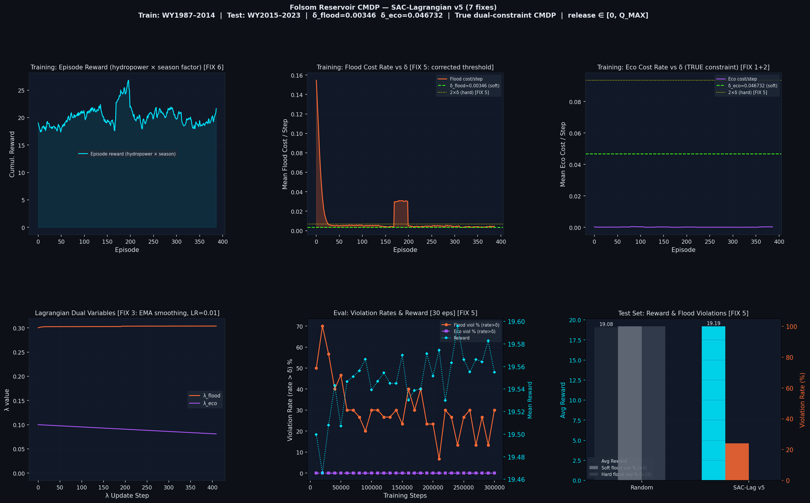

# ReservoirRL

> **Constrained hydropower optimization for Folsom Reservoir using Soft Actor-Critic with Lagrangian dual variables — a true dual-constraint CMDP with flood protection and minimum ecological flow requirements.**

---

## Results at a Glance

| Policy | Avg Reward | Soft Flood Viol (>δ) | Hard Flood Viol (>2δ) | Soft Eco Viol (>δ) |
|--------|-----------|----------------------|-----------------------|--------------------|
| Random | 19.083 | 100.0% | 100.0% | 0.0% |
| **SAC-Lag v5** | **19.187** | **24.0%** | **0.0%** | **0.0%** |

- **δ_flood** (calibrated, frac=0.6): `0.003463`
- **δ_eco** (calibrated, floor=0.001): `0.046732`
- **Final λ_flood**: `0.3039` | **Final λ_eco**: `0.0809`
- **Episode length**: 720 h (30-day rolling windows)

### Training & Evaluation Curves



> *Left to right, top row: episode reward (hydropower × season factor), flood cost rate vs δ, eco cost rate vs δ. Bottom row: Lagrangian dual variable trajectories, eval violation rates over training, test-set reward & violation bar chart.*

---

## Project Overview

This project formulates **Folsom Reservoir dispatch** as a Constrained Markov Decision Process (CMDP) and solves it with **SAC-Lagrangian** — a primal-dual RL algorithm that satisfies long-run cost constraints via learned Lagrange multipliers.

### What makes this a *real* CMDP

In many toy CMDP implementations, constraints are never actually binding. This project deliberately:

1. Maps actions to `release ∈ [0, Q_MAX]` (not `[Q_MIN, Q_MAX]`), so the agent *can* under-release and incur eco-flow penalties.
2. Calibrates δ thresholds against a baseline policy so both constraints are meaningfully active.
3. Uses trimmed-mean + EMA-smoothed Lagrangian updates at full-episode frequency for stable dual convergence.

### Environment Summary

| Parameter | Value |
|-----------|-------|
| Reservoir | Folsom (USBR bathymetry) |
| V_max | 1,246,000,000 m³ |
| V_spill | 1,100,000,000 m³ |
| Q_flood (downstream limit) | 1,415 m³/s |
| Q_min (eco flow) | 14.2 m³/s |
| Q_max (turbine capacity) | 3,256 m³/s |
| Time step | 1 hour |
| Episode length | 720 steps (30 days) |
| Train period | WY 1987–2014 |
| Test period | WY 2015–2023 |

### Observation Space (12-dim)

| Index | Feature |
|-------|---------|
| 0 | Storage fraction (S / V_max) |
| 1 | Normalized head (H − H_min) / (H_max − H_min) |
| 2–4 | Normalized inflow: 1-h, 6-h, 24-h rolling mean |
| 5 | Inflow trend (q1 − q24) / Q_flood |
| 6–7 | Diurnal sine/cosine (period = 24 h) |
| 8–9 | Weekly sine/cosine (period = 168 h) |
| 10 | Cumulative flood budget usage |
| 11 | Cumulative eco budget usage |

---

## Repository Structure

```
rl_project/
├── ReservoirRL_Final.ipynb    # Full training notebook (env + SAC-Lag + training + eval)
├── ReservoirRL_Final.docx     # Project report / write-up
├── results/
│   ├── cmdp_results.png       # Training/eval figure (6-panel)
│   ├── results_summary.txt    # Printed metrics table
│   └── sac_lag_folsom.pt      # Saved model checkpoint
└── README.md
```

---

## Quickstart

### 1. Clone the repo

```bash
git clone https://github.com/<your-username>/folsom-cmdp.git
cd folsom-cmdp
```

### 2. Create a virtual environment (recommended)

```bash
python -m venv venv
source venv/bin/activate          # Linux / macOS
# venv\Scripts\activate           # Windows
```

### 3. Install dependencies

```bash
pip install -r requirements.txt
```

`requirements.txt`:
```
numpy>=1.24
pandas>=2.0
matplotlib>=3.7
gymnasium>=0.29
torch>=2.1
```

> **GPU:** If you have a CUDA-capable GPU, install the matching `torch` build from [pytorch.org](https://pytorch.org/get-started/locally/). The script auto-detects `cuda` vs `cpu`.

### 4. Get the inflow data

The model requires an hourly inflow `.npy` file for Folsom Reservoir. Two options:

**Option A — Kaggle dataset (original source)**
```bash
# Install Kaggle CLI if needed
pip install kaggle
kaggle datasets download akshatmishra111/damnnn -p data/ --unzip
# This places folsom_inflow_hourly.npy inside data/
```

**Option B — Manual download**
Download `folsom_inflow_hourly.npy` from the [Kaggle dataset page](https://www.kaggle.com/datasets/akshatmishra111/damnnn) and place it at `data/folsom_inflow_hourly.npy`.

Then update the path constant at the top of `folsom_cmdp_v5.py`:
```python
NPY_PATH = "data/folsom_inflow_hourly.npy"   # adjust if needed
```

### 5. Train from scratch

```bash
jupyter nbconvert --to notebook --execute ReservoirRL_Final.ipynb
```

Or open it interactively:

```bash
jupyter notebook ReservoirRL_Final.ipynb
```

Training runs for **300,000 environment steps** (~15–30 min on GPU, ~2–4 h on CPU). Progress is printed every 10,000 steps. Outputs written to the working directory:

| File | Contents |
|------|---------|
| `results/cmdp_results.png` | 6-panel training/eval figure |
| `results/results_summary.txt` | Formatted metrics table |
| `results/sac_lag_folsom.pt` | Saved model checkpoint |

### 6. Evaluate a saved checkpoint

Add the following snippet after `main()` (or create a separate `eval.py`):

```python
import torch, numpy as np
from folsom_cmdp_v5 import (FolsomInflowLoader, FolsomCMDPEnv,
                              SACLagrangian, evaluate,
                              CONSTRAINT_D_FLOOD, CONSTRAINT_D_ECO)

ckpt = torch.load("results/sac_lag_folsom.pt", map_location="cpu")
loader = FolsomInflowLoader("data/folsom_inflow_hourly.npy", mode="test")

agent = SACLagrangian(
    obs_dim=12, act_dim=1,
    delta_flood=ckpt["delta_flood"],
    delta_eco=ckpt["delta_eco"],
)
agent.actor.load_state_dict(ckpt["actor"])
agent.lam_flood = ckpt["lam_flood"]
agent.lam_eco   = ckpt["lam_eco"]

global CONSTRAINT_D_FLOOD, CONSTRAINT_D_ECO
CONSTRAINT_D_FLOOD = ckpt["delta_flood"]
CONSTRAINT_D_ECO   = ckpt["delta_eco"]

from folsom_cmdp_v5 import TEST_LOADER
import folsom_cmdp_v5 as m
m.TEST_LOADER  = loader
m.TRAIN_LOADER = loader

rewards, fv, ev, details = evaluate(agent, "test", n_eps=50)
print(f"Mean reward : {np.mean(rewards):.3f}")
print(f"Flood viol% : {np.mean(fv)*100:.1f}%")
print(f"Eco   viol% : {np.mean(ev)*100:.1f}%")
```

---

## Key Hyperparameters

| Constant | Value | Notes |
|----------|-------|-------|
| `N_TRAIN_STEPS` | 300,000 | Total env steps |
| `EPISODE_LEN` | 720 | 30-day episodes |
| `BATCH_SIZE` | 256 | SAC mini-batch |
| `LR_ACTOR / LR_CRITIC` | 3e-4 | Adam LR |
| `LR_LAMBDA` | 0.01 | Dual variable step (EMA-smoothed) |
| `LAMBDA_UPDATE_FREQ` | 720 | Full-episode λ update |
| `GAMMA` | 0.99 | Discount factor |
| `HIDDEN` | 256 | MLP hidden dim |
| `DELTA_FRACTION` | 0.60 | Baseline fraction for δ calibration |
| `ECO_DELTA_FLOOR` | 0.001 | Minimum eco constraint threshold |
| `LAMBDA_FLOOD_INIT` | 0.3 | Initial λ_flood |
| `LAMBDA_ECO_INIT` | 0.1 | Initial λ_eco |

---


## Algorithm: SAC-Lagrangian

The agent optimizes the primal-dual objective:

$$\max_\pi \min_{\lambda \geq 0} \; \mathbb{E}\left[\sum_t r_t\right] - \lambda_\text{flood}(J_\text{flood}(\pi) - \delta_\text{flood}) - \lambda_\text{eco}(J_\text{eco}(\pi) - \delta_\text{eco})$$

**Actor loss:**
$$\mathcal{L}_\pi = \mathbb{E}\left[\alpha \log \pi(a|s) - Q^r(s,a) + \lambda_\text{flood} Q^{c_\text{flood}}(s,a) + \lambda_\text{eco} Q^{c_\text{eco}}(s,a)\right]$$

**Dual update (EMA-smoothed trimmed mean):**
$$\lambda \leftarrow \text{clip}\left(0.9\lambda + 0.1\left(\lambda + \eta_\lambda(\bar{c} - \delta)\right),\; 0,\; \lambda_\text{max}\right)$$

Three separate critic heads are maintained: one for reward, one per constraint cost.

---

## Cost Breakdown (SAC-Lag , test set)

| Metric | Value |
|--------|-------|
| Mean flood cost / step | 0.002127 (δ = 0.003463) ✅ |
| Mean eco cost / step | 0.000000 (δ = 0.046732) ✅ |
| Mean release | 822.8 m³/s |
| Mean spillway | 0.00 m³/s |
| Hard eco violation rate | 0.0% |

---

## Running on Kaggle

The script was developed and benchmarked on Kaggle (P100 GPU). To reproduce:

1. Create a new Kaggle Notebook (GPU accelerator recommended).
2. Add the dataset `akshatmishra111/damnnn` as a data source.
3. Upload `folsom_cmdp_v5.py` and run:
   ```bash
   !python folsom_cmdp_v5.py
   ```
4. Outputs appear in `/kaggle/working/`. Move `cmdp_results.png`, `sac_lag_folsom.pt`, and `results_summary.txt` into the `results/` folder before committing.

---

## Pretrained Checkpoint

A pretrained checkpoint is already committed at `results/sac_lag_folsom.pt`. Use the evaluation snippet above to load it directly — no retraining needed.

---

## License

MIT — see [LICENSE](LICENSE).

---

##  Acknowledgements

- Reservoir bathymetry: [USBR Folsom Dam](https://www.usbr.gov/mp/ncao/folsom.html)
- SAC-Lagrangian formulation follows [Ray et al., 2019 — *Benchmarking Safe Exploration in Deep RL*](https://arxiv.org/abs/1910.01708)
